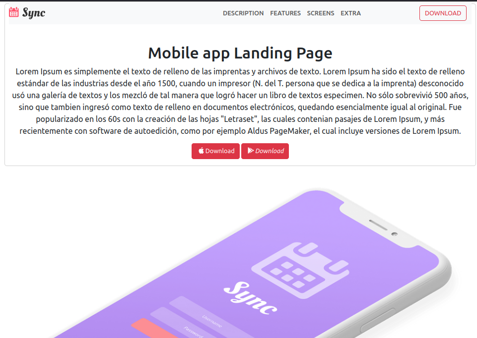

<div align="center">
    
<h3 align="center">P2 Web Replication</h3>

  <p align="center">
    Landing Page
    <br />
</div>
<!-- TABLE OF CONTENTS -->
<details>
  <summary>Table of Contents</summary>
  <ol>
    <li>
      <a href="#about-the-project">About The Project</a>
      <ul>
        <li><a href="#built-with">Built With</a></li>
      </ul>
    </li>
    <li>
      <a href="#getting-started">Description</a>
      <ul>
        <li><a href="#prerequisites">Prerequisites</a></li>
        <li><a href="#installation">Installation</a></li>
      </ul>
    </li>
    <li><a href="#usage">Usage</a></li>
    <li><a href="#contact">Contact</a></li>
  </ol>
</details>
<!-- ABOUT THE PROJECT -->
 <br />
<div align="center">
    
    <br />
</div>
<br />

### Built With

- [![Bootstrap][Bootstrap.com]][Bootstrap-url]

<p align="right">(<a href="#readme-top">back to top</a>)</p>

<!-- GETTING STARTED -->

## Description

This website was built in bootstrap 5, it consists of a static landing page with three sections.
<br />

### Prerequisites

No library is needed to install this project
<br />

### Installation

1. Get a free API Key at [https://github.com/jumelis/p2-replica-web](https://github.com/jumelis/p2-replica-web)
2. Clone the repo
   ```sh
   git clone https://github.com/jumelis/p2-replica-web.git
   ```

<p align="right">(<a href="#readme-top">back to top</a>)</p>

<!-- USAGE EXAMPLES -->

## Usage

This project consists of a static landing page with three sections.
Each of the sections can be accessed by scrolling inside the web page or by clicking on the navigation bar at the top of the page.
In addition to this, the download button located at the top right of the navbar, will take you to the official Factoria F5 website.

<p align="right">(<a href="#readme-top">back to top</a>)</p>

<!-- CONTACT -->

## Contact

Jumelis Rosales - jumelisrosales@gmail.com

Project Link: [https://github.com/jumelis/p2-replica-web](https://github.com/jumelis/p2-replica-web)

<p align="right">(<a href="#readme-top">back to top</a>)</p>

<!-- ACKNOWLEDGMENTS -->
<!-- MARKDOWN LINKS & IMAGES -->
<!-- https://www.markdownguide.org/basic-syntax/#reference-style-links -->

[Bootstrap.com]: https://img.shields.io/badge/Bootstrap-563D7C?style=for-the-badge&logo=bootstrap&logoColor=white
[Bootstrap-url]: https://getbootstrap.com
